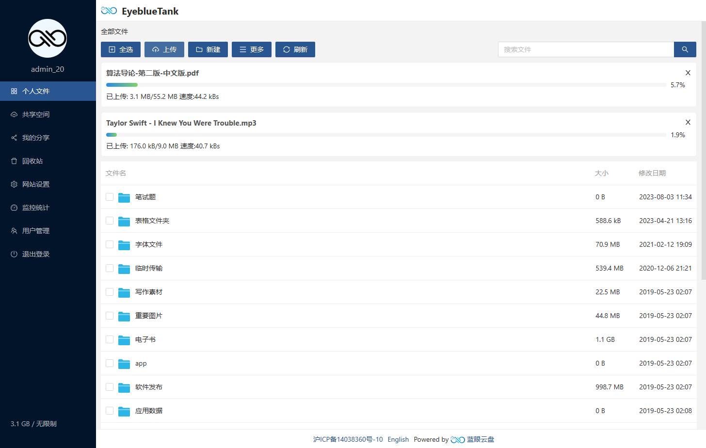
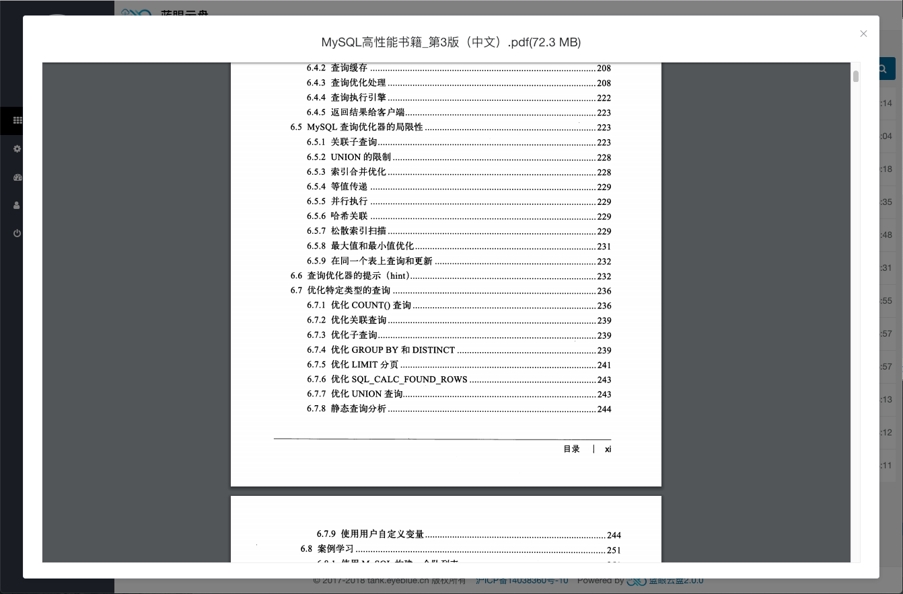
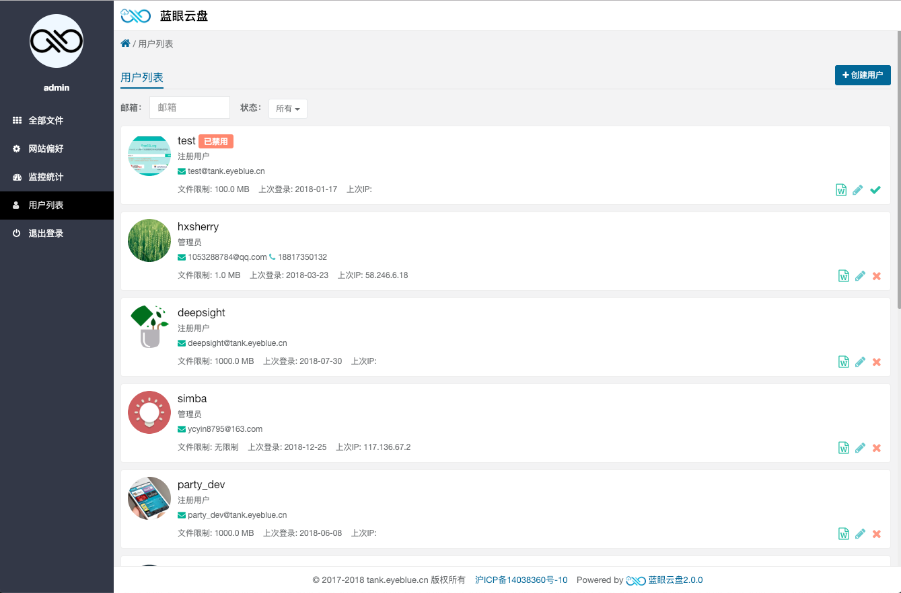
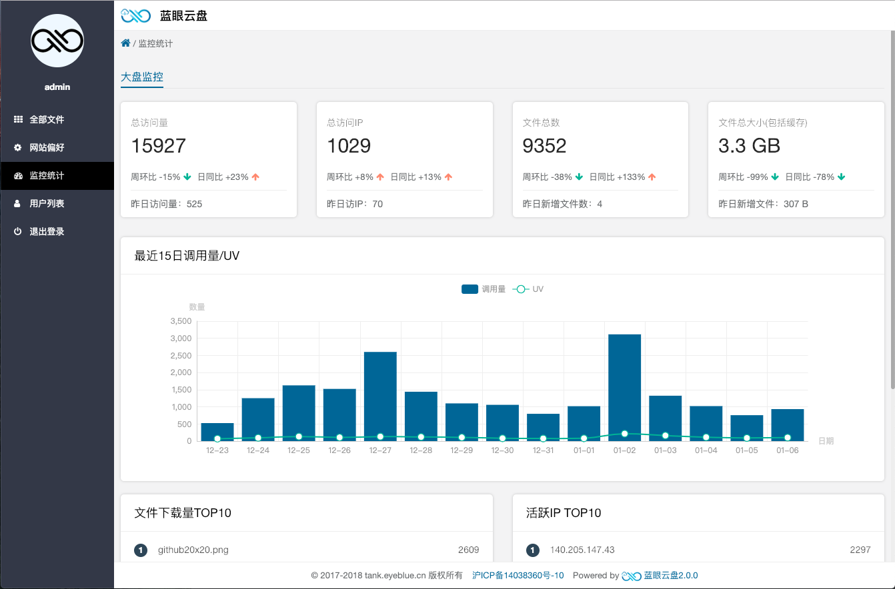
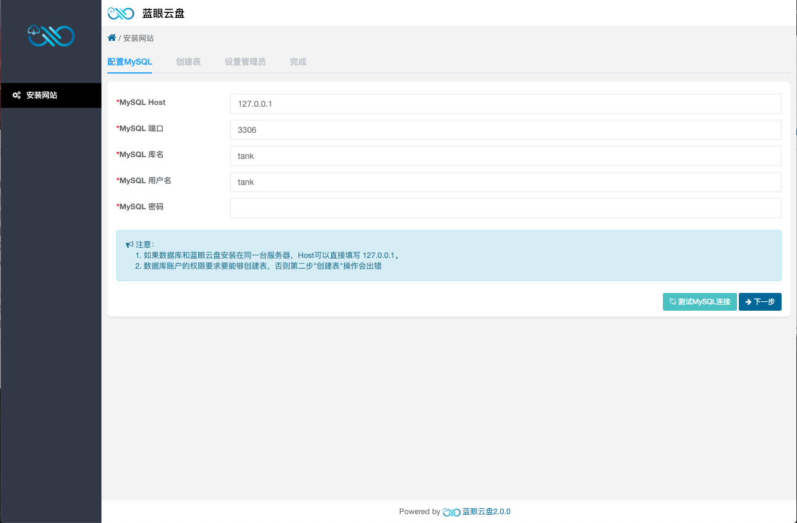
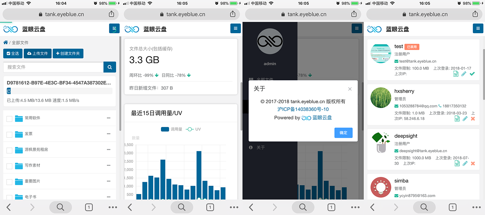

[English Version](./README_EN.md)

# 蓝眼云盘（3.0.4）

[在线Demo](https://tank.eyeblue.cn) (体验账号： demo 密码：123456)

[文档](https://tank-doc.eyeblue.cn/)

### 软件截图

#### PC端截图

#### 手机端截图

#### [安装文档](https://tank-doc.eyeblue.cn/zh/basic/install.html)

### 相关文档

[蓝眼云盘后端api](https://github.com/eyebluecn/tank/blob/master/build/doc/api_zh.md)

[蓝眼云盘编程接口](https://github.com/eyebluecn/tank/blob/master/build/doc/alien_zh.md)

[快速使用Let's Encrypt开启个人网站的https](https://blog.eyeblue.cn/home/article/9f580b3f-5679-4a9d-be6f-4d9f0dd417af) 

 [Docker 化你的开源项目](https://blog.eyeblue.cn/home/article/510f9316-9ca1-40fe-b1b3-5285505a527d)  

### Contribution

感谢所有蓝眼云盘的贡献者 [@zicla](https://github.com/zicla)，[@seaheart](https://github.com/seaheart)，[@yemuhe](https://github.com/yemuhe)，[@hxsherry](https://github.com/hxsherry)

如果您也想参与进来，请尽情的fork, star, post issue, pull requests

当然你可以加入钉钉群一起直接交流

### License

[MIT](http://opensource.org/licenses/MIT)

Copyright (c) 2017-present, eyeblue.cn
